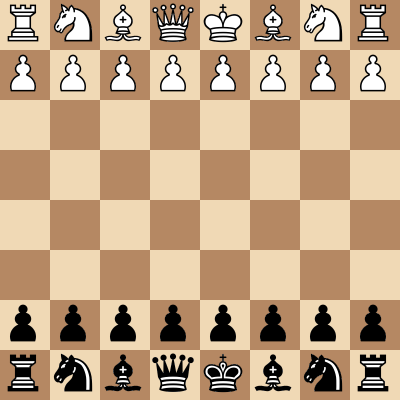

# Fen2img
> A tool to generate chess board image from a Forsyth–Edwards Notation(FEN) string.


## Install

`pip install fen2img`

## How to use

here is an example:

```python
fen2img('rnbqkbnr/pppppppp/8/8/8/8/PPPPPPPP/RNBQKBNR',
        board_style='brown', boards_path='fen2img/boards',
        piece_style='merida', pieces_path='fen2img/pieces')
```





*** The image files for above board and piece styles are copied from [PgnViewer](https://github.com/mliebelt/PgnViewerJS).
