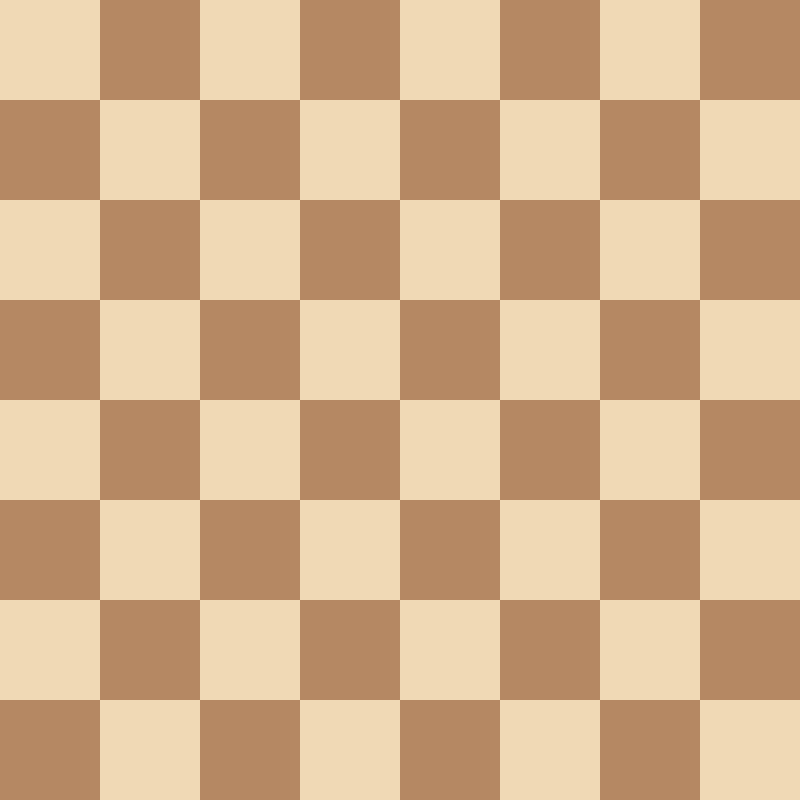

# Fen2img
> A tool to generate chess board image from a Forsyth–Edwards Notation(FEN) string.


## Install

`pip install fen2img`

## How to use

here is an example:

```python
fen2img('rnbqkbnr/pppppppp/8/8/8/8/PPPPPPPP/RNBQKBNR', theme='brown', piece_style='merida')
```


## Supported themes:

|<!-- -->|<!-- -->|<!-- -->|
|:------:|:------:|:------:|
|beyer |blue |brown |
|chesscom |falken |green |
|informator |sportverlag |zeit |


## Supported piece styles:

|<!-- -->|<!-- -->|<!-- -->|<!-- -->|<!-- -->|<!-- -->|<!-- -->|<!-- -->|<!-- -->|<!-- -->|<!-- -->|<!-- -->|<!-- -->|
|:------:|:------:|:------:|:------:|:------:|:------:|:------:|:------:|:------:|:------:|:------:|:------:|:------:|
|merida|||||||||||||
|alpha|||||||||||||
|beyer|||||||||||||
|case|||||||||||||
|chesscom|||||||||||||
|condal|||||||||||||
|leipzig|||||||||||||
|maya|||||||||||||
uscf|||||||||||||
|alpha|||||||||||||
|wikipedia|||||||||||||

*** The image files for above themes and piece styles are copied from [PgnViewer](https://github.com/mliebelt/PgnViewerJS).
